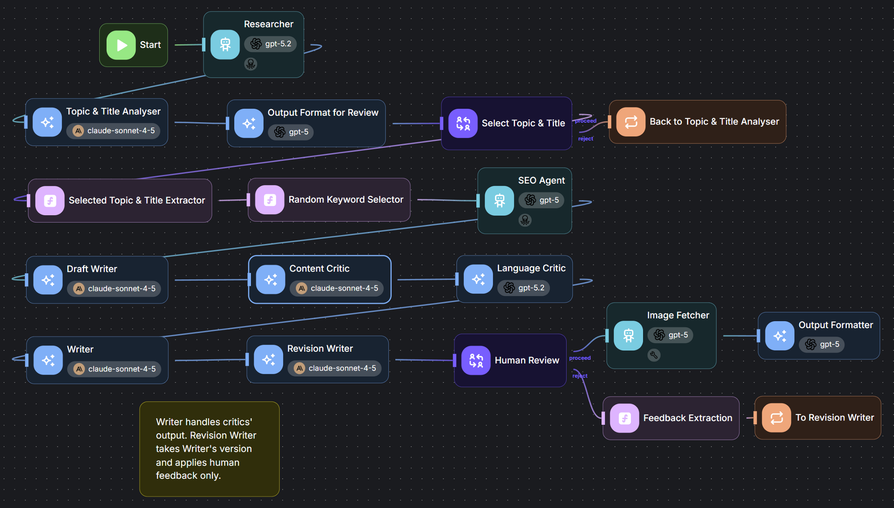

# Thermo Shape Blog Agent

A Flowise multi-agent flow that generates Croatian blog posts for [ThermoShape](https://thermoshape.hr/ari-prica/), a fitness equipment distributor. The flow outputs structured HTML for WordPress.



## Pipeline

| Step | Node | Model |
|------|------|-------|
| 1 | Researcher — scrapes existing blog posts and product pages to build a style reference | gpt-5.2 |
| 2 | Topic & Title Analyser — generates 5 topics, each with 3 title options | claude-sonnet-4-5 |
| 3 | Output Format for Review — formats options for human selection | gpt-5 |
| 4 | **Human input** — select topic and title 
| 5 | SEO Agent — suggests a keyword for the selected topic | gpt-5 |
| 6 | Random Keyword Selector — picks a ThermoShape product keyword and URL | Custom JS |
| 7 | Draft Writer — writes the full post in Croatian | claude-sonnet-4-5 |
| 8 | Content Critic — reviews structure, style, and content quality | claude-sonnet-4-5 |
| 9 | Language Critic — reviews Croatian grammar and language accuracy | gpt-5.2 |
| 10 | Writer — rewrites the draft based on both critics | claude-sonnet-4-5 |
| 11 | **Human Review** — approve or provide revision notes 
| 12 | Revision Writer — applies human feedback | claude-sonnet-4-5 |
| 13 | Image Fetcher — fetches 2 images from Unsplash via custom tool | gpt-5 |
| 14 | Output Formatter — converts markdown blog post to WordPress-ready HTML: wraps content in CSS classes, inserts banner and bottom Unsplash images, adds Font Awesome icons to `<h2>` headings | gpt-5 |

Topic generation and revision each have a loop node allowing up to 3 retry attempts.

Content and language critique are handled by separate models: claude-sonnet-4-5 for creative quality, gpt-5.2 for Croatian language accuracy.

## Files

```
flow/
  Thermo_Shape_Blogger_Agents.json   — main agentflow
tools/
  searchUnsplash-CustomTool.json     — Unsplash image fetcher custom tool
```

## Setup

**Requirements**

- Flowise with Agentflows V2
- Credentials in Flowise for: OpenAI (gpt-5, gpt-5.2), Anthropic (claude-sonnet-4-5), Unsplash

**Import order**

1. Import the custom tool first: Flowise → Tools → Add New → Import → `tools/searchUnsplash-CustomTool.json`. Open the tool and replace `YOUR_UNSPLASH_ACCESS_KEY` with your key from [unsplash.com/developers](https://unsplash.com/developers).

2. Import the agentflow: Flowise → Agentflows → Add New → Import → `flow/Thermo_Shape_Blogger_Agents.json`. Assign credentials to each model node after import — credentials are not included in Flowise exports.

**Client-specific configuration**

The `Random Keyword Selector` node contains a hardcoded ThermoShape product list. Replace with your own:

```javascript
const keywords = [
  { name: "your keyword", url: "https://your-site.com/page/" },
];
```

The Researcher node is configured to scrape specific ThermoShape blog URLs. Update these with your own source URLs.
